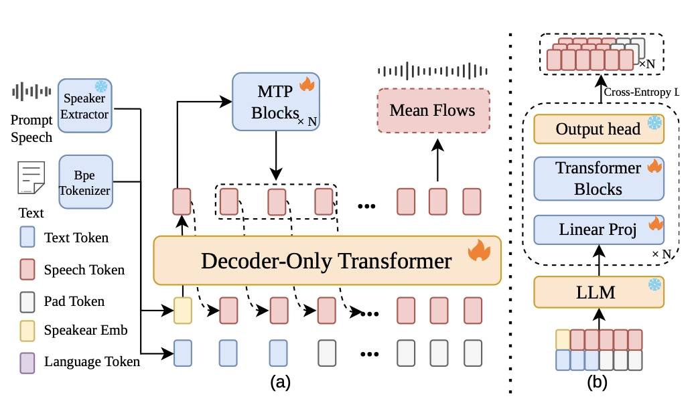

# FlashTTS: Fast Streaming TTS with MTP Acceleration and X-pred Mean Flow Distillation

**FlashTTS** is an open-source, low-latency streaming TTS framework that addresses these limitations. It introduces a **lagged multi-track architecture** that natively processes streaming text and speech inputs, eliminating sentence-level buffering. Acoustic generation is accelerated by integrating **parallel Multi-Token Prediction (MTP)** with an **X-pred mean flow matching** decoder, achieving high-fidelity token-to-mel in exactly **two function evaluations (2-NFE)**. By jointly optimizing input processing and decoding efficiency, FlashTTS offers a practical foundation for real-time speech dialogue systems. Experiments show substantially reduced **First-Packet Latency (325ms)** compared to robust streaming baselines, while preserving **zero-shot voice cloning** and **multi-lingual intelligibility**. Model code and checkpoints are released as open source.

## 🎯 Key Features

- **Native Streaming**: Lagged multi-track architecture for streaming text and speech I/O without sentence-level buffering
- **MTP + X-pred Mean Flow**: Parallel Multi-Token Prediction with X-pred mean flow distillation for fast decoding
- **2-NFE Acoustic Generation**: High-fidelity token-to-mel in exactly two function evaluations
- **Low First-Packet Latency**: 325ms first-packet latency versus robust streaming baselines
- **Zero-Shot Voice Cloning**: Strong few-shot speaker adaptation from reference audio
- **Cross-Lingual Intelligibility**: Preserved quality across languages
- **Open Source**: Model code and checkpoints released for research and deployment

## 📦 System Architecture

<div align="center">



<p style="margin-top: 0.75em; color: #57606a; font-size: 0.95em;">
  <strong>Figure 1.</strong> Architecture overview of FlashTTS: stacked inputs track structure (Stage 1) and multi-token prediction training (Stage 2).
</p>

</div>

### Component Details

```
Text/Speech Input 
    ↓
[Text Tokenizer] + [Speaker Extractor]
    ↓
[LLM Decoder with MTP Acceleration]
    ↓
[Mean Flow X-pred Module] (2-NFE)
    ↓
[HiFi-GAN Vocoder]
    ↓
Audio Output (24kHz)
```

1. **FlashTTS (cosyvoice)**: Core TTS inference (LLM, tokenizer, frontend)
   - Text tokenizer and speaker embedding (CAMPPlus)
   - Decoder-only transformer with multi-token prediction
   - Streaming-input stacking text and speech tracks
   - FlashTTS model: LLM + MeanFlow + vocoder (inference-only)

2. **jit_meanflow_xpred**: Efficient acoustic generation
   - Mean flow matching for 2-NFE mel-spectrogram generation
   - X-pred training objective for improved convergence

3. **Streaming**: First chunk 24 tokens; then 18-token hop with 6-token lookahead per step (24-token context, output 18 tokens per chunk).

4. **Vocoder**: HiFi-GAN waveform generation, 24kHz.

## 🚀 Quick Start

### Example script (recommended)

From the repo root, run the inference example with FlashTTS (text + reference wav) or MeanFlow-only (token file + reference wav):

```bash
# FlashTTS: text-to-speech with voice cloning (needs model_dir with LLM + MeanFlow/vocoder)
python examples/inference.py --mode flash_tts --text "Hello, world." --prompt_wav path/to/ref.wav --output_dir out

# MeanFlow-only: token file + reference wav -> wav (no LLM; for testing acoustic model)
python examples/inference.py --mode meanflow_only --token_path path/to/tokens.npy --prompt_wav path/to/ref.wav --output_dir out

# With streaming (MeanFlow 24/18/6 token chunks)
python examples/inference.py --mode meanflow_only --token_path tokens.npy --prompt_wav ref.wav --output_dir out --stream
```

See `examples/inference.py` for `--model_dir`, `--pretrained_model_dir`, and other options.

### Installation

```bash
# Clone repository
git clone <repo-url>
cd flashtts_opensource

# Install dependencies
pip install -r requirements.txt

```

### Basic Inference (FlashTTS)

FlashTTS uses a config YAML that defines only `llm` (no `flow`/`hift`); the MeanFlow backend is loaded automatically.

```python
from cosyvoice.cli.cosyvoice import FlashTTS

# model_dir: path to your model dir (with llm.pt, cosyvoice2*.yaml, etc.)
# pretrained_model_dir: base dir for configs and MeanFlow/vocoder assets
model = FlashTTS('model_dir', pretrained_model_dir='path/to/pretrained')

# Zero-shot voice cloning
prompt_wav = 'path/to/prompt_audio.wav'  # 16kHz reference
text = "Hello, this is a text-to-speech example."
for output in model.inference_zero_shot(text, "", prompt_wav):
    audio = output['tts_speech']  # [1, samples]
```

### Advanced: MeanFlow Efficient Inference

For fastest inference with the X-pred mean flow module (1 step only):

```python
from jit_meanflow_xpred.infer.infer_meanflow_jit_xpred import (
    inference_meanflow, initialize_model, initialize_vocoder
)
import torch

device = torch.device('cuda' if torch.cuda.is_available() else 'cpu')

# Load models
model = initialize_model(config_path, checkpoint_path, device)
vocoder = initialize_vocoder(vocoder_config, vocoder_ckpt, device)

# Run inference with 2 step (MeanFlow = ultra-fast)
wav, inference_time = inference_meanflow(
    model=model,
    vocoder=vocoder,
    token=token_tensor,           # [B, seq_len]
    spk_emb=speaker_embedding,    # [B, 192]
    prompt_mel=reference_mel,     # [B, T, 80]
    steps=2,                       # MeanFlow: 2 ODE step
    cfg_strength=2.0,              # Classifier-free guidance strength
    device=device
)

print(f"Generated audio shape: {wav.shape}")
print(f"Inference time: {inference_time:.3f}s")
print(f"RTF: {inference_time / (wav.shape[-1] / 24000):.4f}")
```

### Batch Inference

```bash
# Batch inference
python -m jit_meanflow_xpred.infer.infer_meanflow_jit_xpred \
  --prompt_wav ./wav_dir \
  --token_path ./tokens.jsonl \
  --output_dir ./outputs \
  --batch \
  --steps 1

# Streaming inference (24-token first chunk, 18-token hop, 6-token lookahead)
python -m jit_meanflow_xpred.infer.infer_meanflow_jit_xpred \
  --prompt_wav ref.wav \
  --token_path tokens.npy \
  --output_dir ./outputs \
  --stream \
  --steps 1
```

## 📊 Supported Languages

- 🇨🇳 Chinese (Mandarin)
- 🇬🇧 English
- 🇫🇷 French
- 🇩🇪 German
- 🇯🇵 Japanese
- 🇰🇷 Korean

## 🏗️ Project Structure

```
flashtts_opensource/
├── cosyvoice/                      # FlashTTS core (LLM, frontend, CLI)
│   ├── cli/                        # Command-line interfaces
│   │   ├── cosyvoice.py           # FlashTTS entry point
│   │   ├── model.py               # FlashTTS model & inference wrapper
│   │   └── frontend.py            # Audio/text frontend
│   ├── llm/                        # Language model components
│   ├── tokenizer/                  # Text/speech tokenization
│   ├── transformer/                # Decoder-only Transformer architecture
│   ├── utils/                      # Utility functions
│   ├── hifigan/                    # Vocoder components
│   └── vllm/                       # vLLM integration (optional)
│
├── jit_meanflow_xpred/             # Efficient acoustic generation (token2mel + vocoder)
│   ├── model/                     # CFM, DiT, mel_processing
│   ├── infer/
│   │   ├── infer_meanflow_jit_xpred.py   # MeanFlow inference (1-NFE)
│   │   └── utils_infer.py
│   ├── eval/                      # Evaluation scripts
│   └── configs/                   # YAML configs
│
├── third_party/                    # Third-party libraries (53 files)
│   ├── campplus/                   # Speaker embedding extraction
│   │   ├── tools.py               # CAMPPlus inference
│   │   └── checkpoints/           # Pre-trained embeddings
│   └── Matcha-TTS/                 # Flow matching techniques
│
├── examples/                       # Inference examples
│   ├── grpo/
│   ├── huawei/
│   ├── libritts/
│   └── magicdata-read/
│
├── asset/                          # Project assets
│   └── flashtts_overview.jpg       # Architecture diagram
│
├── README.md                       # This file
├── LICENSE                         # Apache 2.0 License
├── requirements.txt                # Python dependencies
├── .gitignore                      # Git ignore rules
```

## 📝 Configuration

### Model Configuration

Core model configs in `jit_meanflow_xpred/configs/`:

```yaml
model:
  arch:
    num_layers: 16              # Transformer layers
    hidden_size: 768           # Hidden dimension
    num_heads: 16               # Attention heads
    vocab_size: 6563            # Token vocabulary
  text_num_embeds: 4096
  mel_dim: 80                    # Mel-spectrogram dimension
  
inference:
  steps: 2                       # MeanFlow: single step ODE
  cfg_strength: 2.0              # Classifier-free guidance scale
  chunk_size: 0                  # 0 = full sequence, >0 = chunk mel frames
```

### Speaker Embedding Configuration

Extracted using CAMPPlus model:
- **Output dimension**: 192
- **Input requirement**: 16kHz, single-channel audio
- **Processing**: Mel-spectrogram → DTDNN layers → 192-dim embedding

## ⚡ Performance

### Latency Metrics

| Metric | Value | Notes |
|--------|-------|-------|
| First-Packet Latency | 325ms | With streaming architecture |
| Mean Flow Steps | 2 | X-pred mean flow: few ODE steps |
| Token-to-Mel Time | ~100ms | On NVIDIA 4090 GPU |
| Mel-to-Wave Time | ~50ms | HiFi-GAN vocoding |

## 🔗 Dependencies

### Core Dependencies
- PyTorch >= 1.13.0
- torchaudio >= 0.13.0
- numpy >= 1.21.0
- scipy >= 1.7.0
- onnxruntime >= 1.12.0
- omegaconf
- hyperpyyaml

See `requirements.txt` for complete list with specific versions.

## 📄 License

This project is licensed under the Apache License 2.0. See [LICENSE](LICENSE) file for details.

## 🙏 Acknowledgments

FlashTTS builds upon:
- **CosyVoice**: TTS backbone and LLM decoder design
- **F5-TTS**: Flow matching backbone and generation
- **HiFi-GAN**: High-fidelity neural vocoder architecture
- **CAMPPlus**: Speaker embedding extraction via contrastive learning